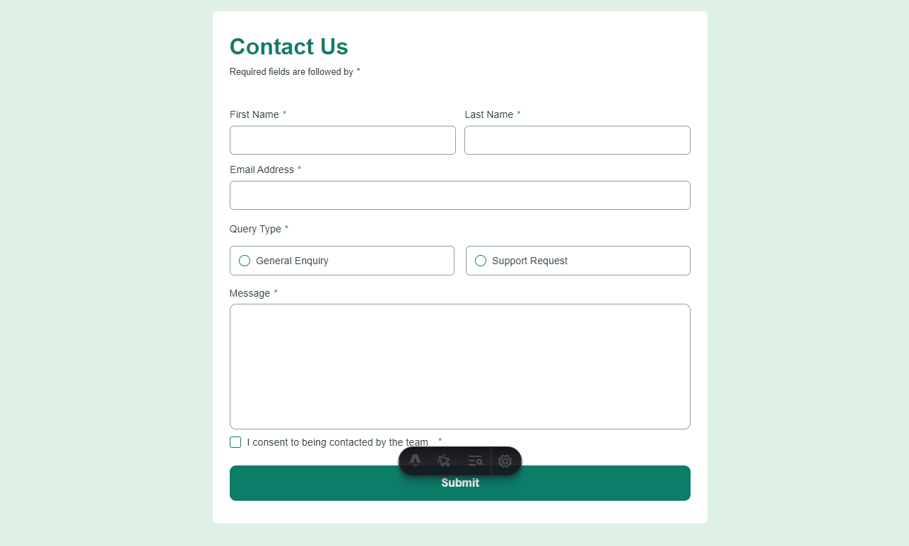

# Frontend Mentor - Contact form solution

This is a solution to the [Contact form challenge on Frontend Mentor](https://www.frontendmentor.io/challenges/contact-form--G-hYlqKJj). Frontend Mentor challenges help you improve your coding skills by building realistic projects.

## Table of contents

- [Overview](#overview)
  - [The challenge](#the-challenge)
  - [Screenshot](#screenshot)
  - [Links](#links)
- [My process](#my-process)
  - [Built with](#built-with)
  - [What I learned](#what-i-learned)
  - [Continued development](#continued-development)
  - [Useful resources](#useful-resources)
- [Author](#author)
- [Acknowledgments](#acknowledgments)

## Overview

### The challenge

Users should be able to:

- Complete the form and see a success toast message upon successful submission
- Receive form validation messages if:
  - A required field has been missed
  - The email address is not formatted correctly
- Complete the form only using their keyboard
- Have inputs, error messages, and the success message announced on their screen reader
- View the optimal layout for the interface depending on their device's screen size
- See hover and focus states for all interactive elements on the page

### Screenshot



### Links

- Solution URL: [Github](https://github.com/ikennarichard/contact-us)
- Live Site URL: [Live Site](https://contact-us-fm.netlify.app)

## My process

### Built with

- Mobile-first workflow
- [React](https://reactjs.org/) - JS library
- React-hook-form
- SASS

### What I learned

I use this project as a way to use the react hook form, and i'm impressed with its simplicity and powerful features. It made the project a whole lot easier to setup.

```tsx
const {
  register,
  handleSubmit,
  formState: {errors}
  } = useForm<Inputs>();

const onSubmit: SubmitHandler<Inputs> = () => {
  //  handle form submission
}
```

### Continued development

- Maintaining fast build times and optimized output.
- Understanding Astro's build process and how React components affect it.

### Useful resources

- [React hook form](https://react-hook-form.com) - This helped me for everything i needed to understand react hook form. I like how the docs was not too complicated, and provided meaningful examples.

## Author

- Website - [Richard](https://ikennarichard.vercel.app)

## Acknowledgments

Thanks to Frontend Mentor for their invaluable support, and to the React Hook Form team for creating such an amazing tool. Thank you!
